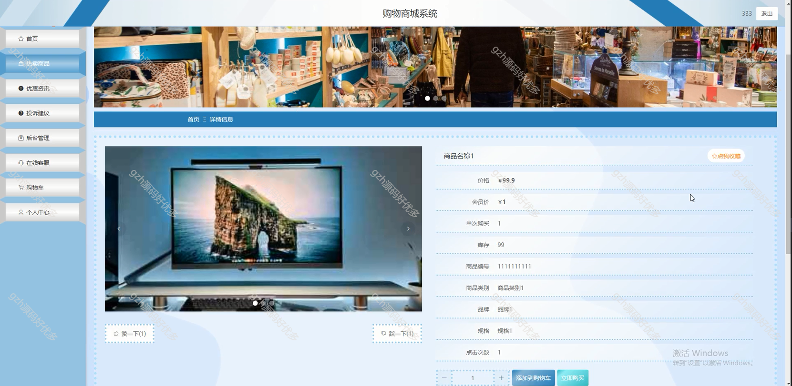

# python022
python022基于Django的购物商城系统
 
## 查看主页获取源码

### 一、关键词

购物商城，购物平台，购物商城系统

 

### 二、作品包含

源码+数据库+设计文档万字+全套环境和工具资源+部署教程

 

### 三、项目技术

前端技术：Html、Css、Js、Vue2.0、Element-ui
后端技术：Python3.7、Django2.0

  

 

### 四、运行环境（以下版本亲测，其他版本未知，请自测）

开发工具：PyCharm + VSCODE

数据库：MySQL5.7（最低要5.7版本）

数据库管理工具：Navicat10+

Python：Python3.7

前端Nodejs：14

浏览器：谷歌浏览器

 

### 五、项目介绍

项目编号：python022

对购物商城管理的流程进行科学整理、归纳和功能的精简，通过软件工程的研究方法，结合当下流行的互联网技术，最终设计并实现了一个简单、易操作的购物商城系统。

系统使用过程主要涉及到管理员和用户两种角色，主要包含个人中心、用户管理、商品类别管理、热卖商品管理、投诉建议、系统管理、订单管理等功能。

 

### 六、运行截图

